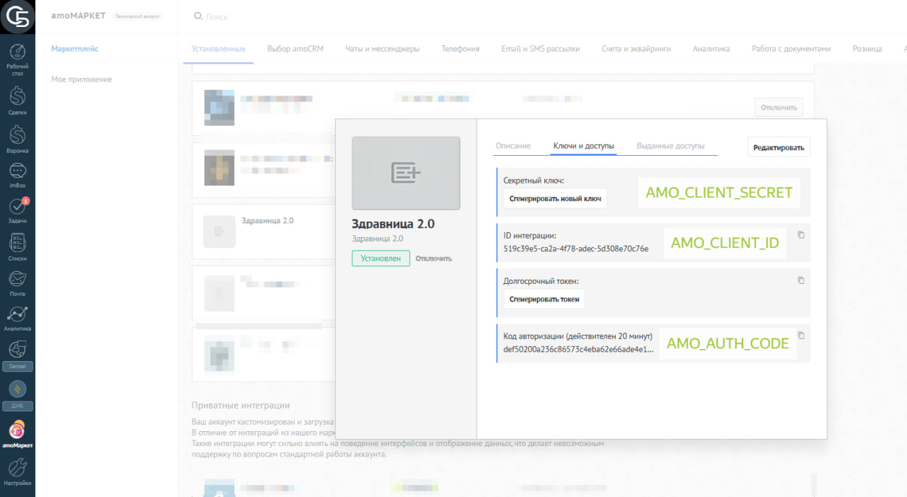
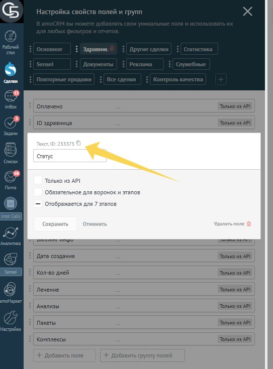

# Интеграция RDESK для AmoCRM

## Внутреннее устройство

Данная интеграция состоит из 2 docker контейнеров: nginx (openresty) и rdesk-amo-sync(ссылка).

---
**Nginx** выступает в качестве обратного прокси. Также имеет вариант запуска с зеркалированием входящего трафика на сторонний сервер для тестирования.
**Rdesk-amo-sync** получает данные, трансформирует, отправляет с авторизацией в домен **AmoCRM**.


## Принцип работы

При *добавлении/обновлении* данных в **RDESK** (СПК Здравница), данные отправляются в **AmoCRM** , через данный сервис. Сервис выступает своего рода шлюзом для интеграции. Он обеспечивает трансформацию данных, а также осуществляет авторизацию OAuth 2.0 в **AmoCRM**.
Для возможности инициализировать данные из AmoCRM в Здравцницу, необходимо воспользоваться [amo-widget](https://github.com/dyuzha/amo-widget).

---

 *Данные считаются добавленными/обновленными при формировании/изменения счета привязанного к карточке в Здравнице.*

## Установка и запуск

```bash
git clone https://github.com/dyuzha/amo-services.git

cd amo-services

docker compose up -d # (Должен быть установлен docker)
```

---

1. Настройка клиентской части.
Создать интеграцию в аккаунте **AmoCRM**  *(публичную или приватную)*.
Для визуализации сводных данных пришедших из **СПК Здравницы**, а также для инициализации данных из **AmoCRM** в **СПК Здравницу**, необходимо воспользоваться виджетом (ссылка на виджет).

2. Установка docker, compose.
3. Установка репозитория.
```bash
git clone https://github.com/dyuzha/amo-services.git
cd amo-services
mv ./docs/example.env .env
```
4. Настройка (ссылка на настройку)
Заполнить .env файл

5. Запуск приложения
```bash
docker compose up -d # (Должен быть установлен docker)
```
6. Настройка автозапуска для **RedHat** дистрибутивов на примере **CentOS 11**.
6.1. Создать пользователя для запуска сервиса.
```bash
useradd -m amo-staff
chmod amo-staff
# *******
```
6.2. Выдать права пользователю на сервис.
```bash
chown -R amo-staff:amo-staff amo-services
```
6.3. Сделать autologon.
```bash
loginctl enable-linger profit

# Проверка
loginctl show-user profit | grep Linger
# Linger=yes
```
6.4. Создать и настроить сервис.
```bash
mv docs/amo-services.service /etc/systemd/system/amo-services.service

# Перезагружаем конфигурацию systemd для чтения нового юнита
sudo systemctl daemon-reload

# Включаем автозагрузку сервиса
sudo systemctl enable amo-services.service

# Запускаем сервис
sudo systemctl start amo-services.service

# Проверяем статус и логи
sudo systemctl status amo-services.service
journalctl -u amo-services.service -f
```
7. Тестирование
```bash
./tests/test_api_booked.sh https://example.domain/zdrav/booked
./tests/test_api_mc.sh https://example.domain/zdrav/mc

# Проверка тестов
journalctl -u amo-services.service -f
```
При надобности можно внести изменения в данных для тестов из ./tests/test-booked.json  и ./tests/test-mc.json


## Тестирование и разработка

Для удобства тестирования с реальными данными, есть возможность запуска сервиса в режиме mock_lead_id.


### Принцип работы

Lead ID в AmoCRM уникальное нередактируемое поле любого "Лида". Данные приходящие из здравницы имеют lead_id, соответсвующие реальным lead_id из домена AmoCRM. Следовательно, если подключить интеграцию к стороннему (тестовому домену), то данные не смогут приходить в АмоСРМ, по причине отсутствия совпадения Lead ID, для такой ситуации был создан режим подмены (mock_lead_id).

---

Данный режим делает следующие:
1) При поступлении данных с lead_id=23337381, проверяет наличие сделки с названием ID_23337381.
2. Если сделка найдена, то использует lead_id найденной сделки для обновления данных. Иначе, создает новую сделку с именем ID_23337381, после чего использует ее lead_id, для загрузки данных.
Таким образом, можно легко переключаться в режим тестирования и подключать интеграцию к любому домену, для этого необходимо запустить ее в режиме mock_lead_id.


### Запуск в режиме mock_lead_id
```dockerfile
# Необходимо запустить amo-gate сервис с флагом mock_lead_id
command: ["python", "main.py", "--mocked-lead-id"]

# Было
# command: ["python", "main.py"]
```


## Настройка nginx для тестирования
---
Когда сервисы работают и запущены, может появится надобность в ретранслировании трафика на тестовый сервер.
Пример:
```bash
Сервер A                            Домен Amocrm A
(Основной сервер)       --->        (Основной домен)

                                    # в режиме mock_lead_id
Сервер B                            Домен Amocrm B
(ПК Разработчика)       --->        (домен для тестирования)
```

---

Необходимо чтобы трафик, приходящий на Сервер А дублировался на сервер B.
Для этого необходимо в `.env` файле указать адрес сервера для зеркалирования и включить режим зеркалирования, указав соответствующий файл шаблона (подробнее см. в разделе "Настройка").
```bash
# Путь до шаблона
NGX_TEMPLATE_CONF=./nginx/nginx.mirror-template.conf

# Адрес для зеркалирования
MIRROR_TARGET=https://mirror-domain.example.ru
```
Таким образом получиться примерно такая схема.
```bash
# в режиме зеркалирования
# на сервер B
Сервер A                            Домен Amocrm A
(Основной сервер)       --->        (Основной домен)

                                    # в режиме mock_lead_id
Сервер B                            Домен Amocrm B
(ПК Разработчика)       --->        (домен для тестирования)
```


## Настройка
---

Основные настройки nginx
```bash
NGX_PORT=6000           # (По сути ни на что не влияет)
HOST_PORT=9000          # (Порт на котором будет доступен NGINX из внешки)
NGX_SERVER_NAME=domain.example.ru
SSL_FULLCHAIN_FILE=./path/to/fullchain.file
SSL_KEY_FILE=./path/to/key.file
KEEPALIVE_TIMEOUT=60
```

Определяет шаблон конфигурации, с зеркалированием / без зервкалирования
Опредеяет адрес для зеркалирования (удобно для отладки, можно сделать включить данный режим и параллельно с работой сервиса, тестировать новый функционал с актуальными данными в режим реального времени на стороннем сервере, например на ПК разработчика.)
```bash
# Путь до шаблона
NGX_TEMPLATE_CONF=./nginx/nginx.conf.template
# С режимом зеркалирования (для отладки)
# NGX_TEMPLATE_CONF=./nginx/nginx.mirror-template.conf

# Адрес для зеркалирования
MIRROR_TARGET=https://mirror-domain.example.ru
```

---

Основные настройки
```bash
# ID интеграции
AMO_CLIENT_ID=

# domain организации (все что до .amocrm.ru)
AMO_SUBDOMAIN=
# Должен совпадать с "ссылкой для перенаправления" (Каждый символ),

# находится в меню редактирования интеграции (первая ссылка).
AMO_REDIRECT_URL=

# Сгенерировать при первом подключении
AMO_CLIENT_SECRET=

# Обновить при необходимости
AMO_AUTH_CODE=
```



---

```bash
# --- APP settings --- #
# Endpoint для каждой воронки (какие endpoint'ы будет слушать сервер)
APP_INCOMING_MC=/zdrav/mc
APP_INCOMING_BOOKED=/zdrav/booked
```

---

```bash
# Маппинг полей AmoCRM
FIELD_SHARED_CREATED_AT=1287599
FIELD_SHARED_PAID_PRICE=1305167
FIELD_SHARED_ZDRAV_ID=1305111

FIELD_BOOKED_STATUS=1304923
FIELD_BOOKED_CHECK_IN=1305059
FIELD_BOOKED_CHECK_OUT=1305061
FIELD_BOOKED_GUESTS=1304335
FIELD_BOOKED_DOC_NUM=1305107
FIELD_BOOKED_BILL_DATA=1304929
```



---

Настройки для тестирования
```bash
# --- Mock settings --- #
# ДАННЫЕ НАСТРОЙКИ БУДУТ ИСПОЛЬЗОВАТЬСЯ ТОЛЬКО ДЛЯ РЕЖИМА ПОДМЕНЫ lead_id.

# Если вы не используете данный режим, данные настройки ни на что не повлияют
# Лучше оставить закоментированными.

# Если вы используете режим подмены, то сдесь необходимо указать ID воронок и
# этапов (см. https://www.amocrm.ru/developers/content/crm_platform/leads_pipelines)
# В случае игорирования данных параметров, лиды будут созданы в вороронке по
# умолчанию в самом первом статусе.

MOCK_PIPELINE_BOOKED_ID=10156066
# MOCK_PIPELINE_MC_ID=10164486
# MOCK_PIPELINE_BOOKED_STATUS_ID=80453094
# MOCK_PIPELINE_MC_STATUS_ID=80512650
```

